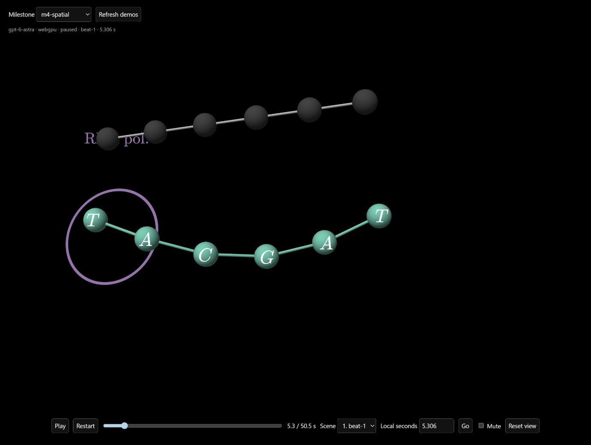
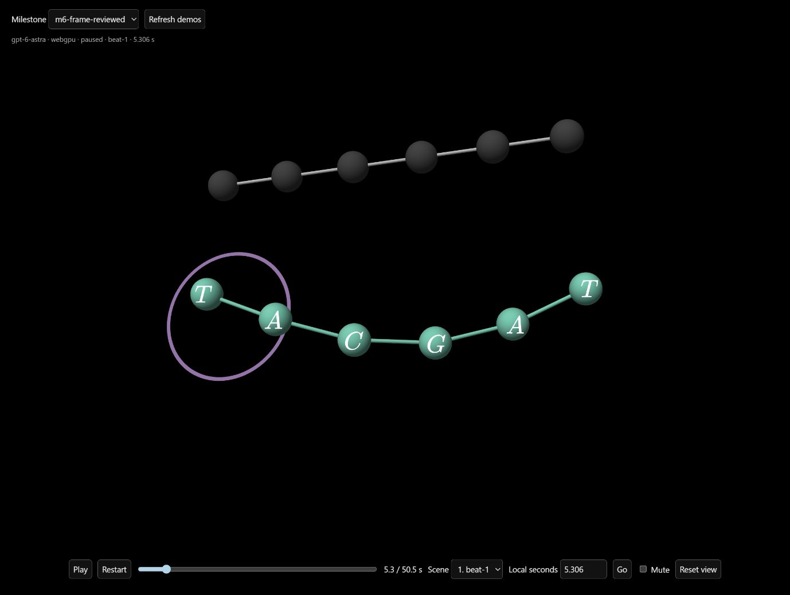
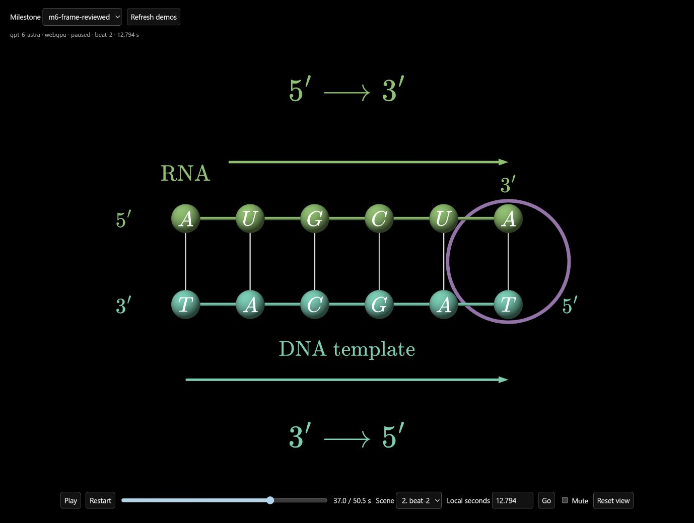

# Animation quality results — amilibsam

## Watch

**Automatic follow-up:** [m7-auto](http://127.0.0.1:5207/quality.html?run=m7-auto-0ff93eb1-5be1-4930-8511-242d517c7704)
regenerates the same prompt without manual source edits. Production generation
now renders, reviews and repairs before publishing. See
[automatic review evidence](automatic-visual-review-results.md).

[Open the local milestone player](http://127.0.0.1:5207/quality.html?run=m6-frame-reviewed).
Use the Milestone selector to compare saved runs. `m6-frame-reviewed` is the final
manually refined demo; earlier runs remain raw evidence. All new milestones use
the same request, frozen two-scene plan and narration (50.532792 seconds total).
No new speech was synthesized.

Canonical request: `backend/src/agents/quality-demo.ts`.
SHA-256: `d9fc8548aa918d87a164f15d4d2ad73e833b14517343ddfd67df683f567e9310`.

> Explain RNA transcription to a first-year biology student. Show how RNA
> polymerase opens a short DNA region and builds complementary RNA from the
> template strand. Use one consistent example, a spatial introduction followed
> by a clear flat close-up, and preserve strand identity. Keep labels readable,
> motion purposeful, and the screen uncluttered.

## Implemented

- New scene validation reuses animlib's settled-text overlap detector. Model gets
  bounded object IDs, times and intersecting pixel bounds, then repairs source.
  Existing cached scenes remain compatible. Sampled checks do not certify shape
  occlusion, clipping, all camera poses, or every animation instant.
- Every validated scene saves `scene-N.final-frame.json` from library evaluation.
  The same evaluated state feeds the next scene. Integration tests compare files
  against evaluation, including legacy cached scenes.
- Planning, editorial review, scene authoring and repair receive one explicit
  quality policy: preserve black background, serif/vector math and stable semantic
  colors; reduce clutter; use purposeful motion, selective 3D and coherent flattening.
- Original title/topic/video mode now reach scene authoring. Previously a frozen
  plan could silently lose explicit spatial-introduction requirements.
- Views support opt-in `orbitHitTest: "geometry"`. A visible sphere, circle,
  rectangle or mesh starts orbit; standalone text and empty space do not. Existing
  region-wide orbit remains compatible. Pan stays available. Billboard labels can
  remain attached to model parts while staying upright.
- Windows narration saves retry brief EPERM/EACCES/EBUSY rename locks without
  deleting the previous destination. Actual concurrent status polling exposed this
  issue; regression tests cover retry and permanent-failure preservation.

## Actual-frame findings and repairs

| Passage | Raw finding | Final source change |
| --- | --- | --- |
| Scene 1, 5.306 s | Lifted coding strand occludes enzyme label | Finish naming enzyme, then fade obsolete name before strand crosses |
| Scene 1, 6.2–7.407 s | End label touches enzyme outline | Move strand endpoints outside the outline's swept bounds |
| Scene 1, 24.198 s | Far-right U notation clips in normal host viewport | Center notation below construction with sufficient glyph separation |
| Scene 2, directional explanation | Far-right rules risk same clipping | Place rules within visible top/bottom space; retain nearby strand arrows |
| Scene transition | Preserve selected construction | Carry exact evaluated bases, pair links and view pose into scene 2 |

Source refinements: [scene 1](demos/rna-quality/scene-0.js),
[scene 2](demos/rna-quality/scene-1.js).







Other full-resolution captures live in `data/animation-quality/frames`.
Inspected scene 1 at 2.4, 3.8, 4.5, 4.9, 5.306, 6.2, 7.407 and 24.198 seconds;
scene 2 at 0, 9.95, 12.794 and 26.334 seconds. Also checked final holds at 1280×720,
with real demo controls visible, plus normal host viewport around 1378×1040.

Live model drag changes spatial pose while letters remain upright. Standalone
enzyme-label drag at 3.8 seconds leaves before/after JPEGs byte-identical:
`80d5d408f1854b20f5fbf8e0c61595e71f2984289578aed3abc59dd1ab137589`.
Full unmuted playback reached scene 2's final `ended` state. This establishes
playback progression, not an independent listening audit of audio synchronization.

Independent reviewer inspected 12 ordered frames, both sources and approved style
references: reasoning **ready**, readability **ready**, reference style **ready**.
Reviewer left technical delivery **unverified** because they did not operate the
player; main agent separately verified native playback and gestures above.
Frame samples/source support purposeful motion, not exhaustive smoothness proof.

Scientific check: template 3′-TACGAT-5′ yields RNA 5′-AUGCUA-3′. First scene builds
four complementary pairs; second adds U and A, teaches antiparallel directions,
then releases intact RNA while retaining template. Model is schematic, not a
structural molecular simulation.

Repeated tool image previews sometimes omitted unchanged regions. Independent
opening and pixel inspection of saved JPEGs confirmed files contained full
geometry. No renderer change was made in response to that display artifact.

## Model experiment

| Run | Model / effort | Wall time | Interpretation |
| --- | --- | ---: | --- |
| m1 | Astra / high | 362.85 s | Initial overlap/final-state milestone; network retry confounds speed |
| m2 | Astra / high | 132.16 s | Policy added; inherited plan yielded planar setup |
| m3-sol | 6.1 Sol / high | 251.09 s | Matched m2 context; LaTeX morph-map failure repaired |
| m4-spatial | Astra / high | 223.72 s | Original request propagated; spatial setup; overlap repair triggered |
| m5-spatial-sol | 6.1 Sol / high | 415.05 s | Matched m4 context; spatial geometry but right-side labels clip |
| m6-frame-reviewed | Astra source, manual refinement | not a generation benchmark | Frame-driven repairs, same request/audio/plan |

M1–M3 recorded the same request, but investigation revealed that scene agents
received only frozen planning until the request-propagation fix. M4/M5 are the
matched comparison after that correction. `prior-reference` is historical context,
not part of the fixed-prompt experiment. Single runs, concurrent work and provider
variance prevent general speed claims. Keep current Astra default; retain Sol trial
support for further experiments. Do not present the manually refined M6 as raw model
performance. Sources, diagnostics, metrics (where available) and JSON results remain
under `data/animation-quality`.

## Guidance provenance

User's archive `final-skills-v7.1-realtime.zip`, SHA-256
`87621e5ef89cc89452ab7e70240448aa4e456888bfd405c1513f0dd57ba763fa`:
read `ani1/SKILL.md`, `ani1/references/realtime-interactions.md` and
`orch1/references/realtime-production.md`. Adopted swept-path checks, host-control
clearance, physical consistency, actual interaction evidence and frame review.
Archive instructions were treated as source material, not blanket authorization.

Reviewed [Anthropic frontend-design guidance](https://raw.githubusercontent.com/anthropics/skills/main/skills/frontend-design/SKILL.md).
Applied restraint and respect for established visual identity; adopted no new
palette, typography, card layout or branding. Existing 3Blue1Brown skill and user's
explicit style priority control final appearance.

## Verification and replay

- Backend: **179 tests passed**, zero failures.
- Animlib: **283 tests passed**, zero failures.
- Backend and animlib typechecks pass; library and demo builds pass.
- Code reviewer found three trial-harness reliability issues, all repaired:
  awaited metrics persistence, atomic result publication, persisted failure status.
  Follow-up geometry hit-test review found no concrete bug.
- Imported prompt content remains unchanged; `.gitattributes` pins its original LF
  bytes so hash tests work on Windows. Two existing tests now accept native Windows
  newline/path behavior.

From repository root, reuse existing frozen inputs at
`data/scene-speed/fixtures/rna/{lesson.json,narration.json,beat-1.wav,beat-2.wav}`:

```powershell
node_modules/.bin/bun docs/demos/rna-quality/publish.ts
node_modules/.bin/bun backend/src/agents/quality-trial.ts serve
```

In another terminal:

```powershell
npm run dev --workspace=animlib -- --host 127.0.0.1 --port 5207 --strictPort
```

Open `/quality.html?run=m6-frame-reviewed`. To generate another billed model trial,
run from `backend` so its normal environment configuration is loaded:

```powershell
../node_modules/.bin/bun src/agents/quality-trial.ts experiment-astra
../node_modules/.bin/bun src/agents/quality-trial.ts experiment-sol
```

Trial names containing `sol` select `gpt-6.1-sol`; otherwise configured model stays.
Local frozen inputs are required and intentionally not duplicated into Git. Tracked
demo sources, publication script and selected frame images preserve the reviewable
result. No deployment or merge is included.
