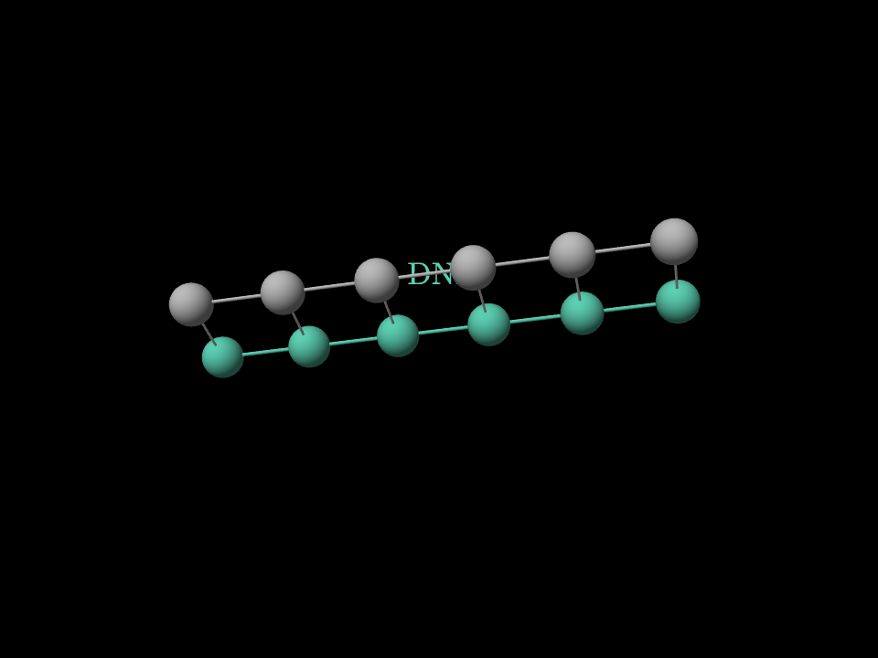
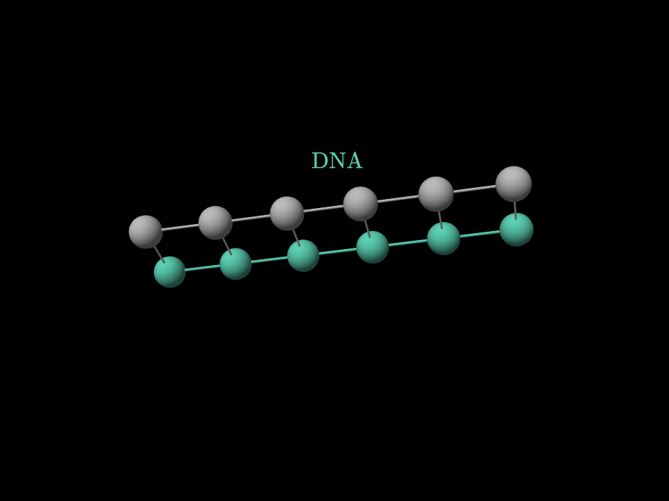
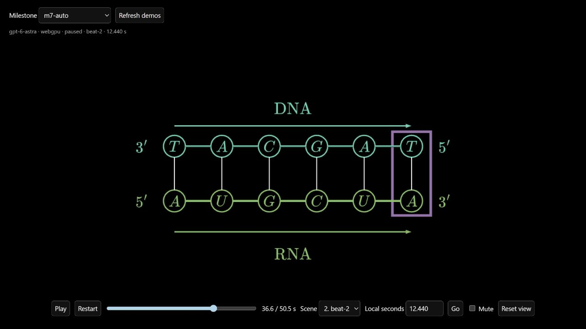

# Automatic visual review — fresh RNA generation

Branch: `amilibsam`. Run: `m7-auto`, video
`0ff93eb1-5be1-4930-8511-242d517c7704`.

[Watch the automatic run](http://127.0.0.1:5207/quality.html?run=m7-auto-0ff93eb1-5be1-4930-8511-242d517c7704).

## What is automatic

The production `createPiGenerator` now validates, renders, reviews, repairs and
re-renders each new scene before saving its playable source. There is no user or
environment switch that skips this gate. Unit tests inject its boundary when
isolating other contracts; the fresh demo uses the default production gate.

- Shared renderer preparation catches invalid LaTeX morph mappings and palette
  errors inside the author's validation/repair loop.
- New viewer rotation must use geometry-targeted views. Whole-canvas orbit and
  views that allow text/empty-space orbit starts fail validation.
- The production renderer produces 12 sampled frames at each of 1280×720 and
  960×720. Sampling includes start/end, a nonzero introduction, camera transition
  interiors, and evenly spread action/hold samples.
- Independent model calls review contact sheets alongside the original request,
  narration, API, source and an approved style-reference image. A repair must
  retain narration, duration, plan, identities and style, then render again.
- Three rejected candidates stop publication. GPU/runtime failures also stop it.
- Each candidate, full frame, contact sheet, finding and approval is saved under
  `data/animation-quality/<videoId>/scene-N.visual/`. The approval receipt hashes
  the exact source published; library evaluation saves its final handoff frame.
- Existing cached videos remain playable. This is a gate for newly authored scenes.

## Controlled run

The canonical prompt, frozen two-scene plan and existing narration match the
earlier milestones. Fresh scene sources were generated; no source was manually
edited. No new speech was synthesized. Model: `gpt-6-astra`.

Prompt SHA-256:
`d9fc8548aa918d87a164f15d4d2ad73e833b14517343ddfd67df683f567e9310`.

Scene 0's first frame review found its introductory DNA label obscured by the
grey partner strand at 2.016524 seconds, in both aspect ratios. The model moved
the label above the model, faded it before opening, and restored it in the flat
explanation. A second set of 24 rendered frames passed a fresh review. This
repair occurred inside generation, before `scene-0.js` was published.

Scene 1 passed its first visual review. Total generation time: 501.19 seconds;
two scene-author calls and three independent visual-review calls (each may use
validation retries internally). The pipeline saved 72 native frames across the
three candidates. Both final sources match their approval SHA-256 receipts and
pass the final quality validator. Saved final frames exactly match library
evaluation, including the state inherited by scene 1.

| Evidence | Before automatic repair | After automatic repair |
| --- | --- | --- |
| Intro at 2.016524s, 4:3 |  |  |

The generated [scene 0](demos/rna-auto/scene-0.js) and
[scene 1](demos/rna-auto/scene-1.js) are byte-for-byte copies of the approved
outputs. [Provenance](demos/rna-auto/provenance.json) records both hashes. These
files were copied for review, never hand-refined.

Independent review of scene 0 found reasoning, readability and reference style
ready. Live checks at 2.017 seconds showed identical canvas pixels after dragging
the DNA label, and changed pixels after dragging a sphere. Black background,
mathematical serif labels, stable teal/green/purple roles, and the spatial-to-flat
construction remain intact.

Independent scene-1 review also passed reasoning, readability and style. Its
completed copy is `3′ TACGAT 5′ → 5′ AUGCUA 3′`; final release retains intact RNA
and unchanged DNA. Both aspect ratios keep labels and endpoints inside frame.

Verification: 186 backend tests, 283 library tests, both typechecks, and the
real-renderer nonblank-pixel smoke test passed. Independent code review found no
remaining concrete defect after the renderer-validation repair.

Live 4:3 playback advanced continuously through both scenes to `ended` at
50.532 seconds with no browser errors. Native frames and live 16:9/4:3 checks
preserve label and playback-control clearance. The scene-2 sequence below comes
from the unedited generated source in the live player.

## Verification limits

Still-image review certifies sampled evidence, not every animation instant or
arbitrary orbit pose. Native frames omit host controls; review reserves the top
and bottom 12%, and live inspection checks the demo's actual controls.

Local native GPU smoke rendering passed. Docker runtime verification was blocked
because the local Docker daemon was unavailable. The Docker image build now
runs the same nonblank-pixel smoke test as its non-root application user, so
an incompatible software GPU or native dependency fails the build.
