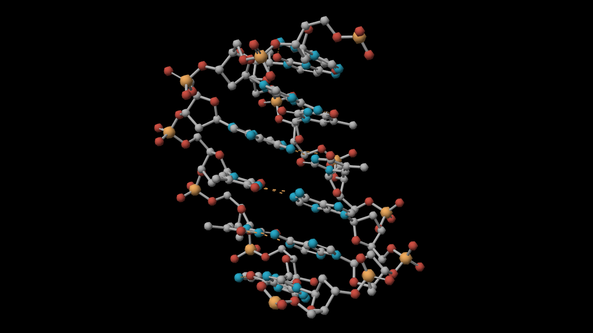
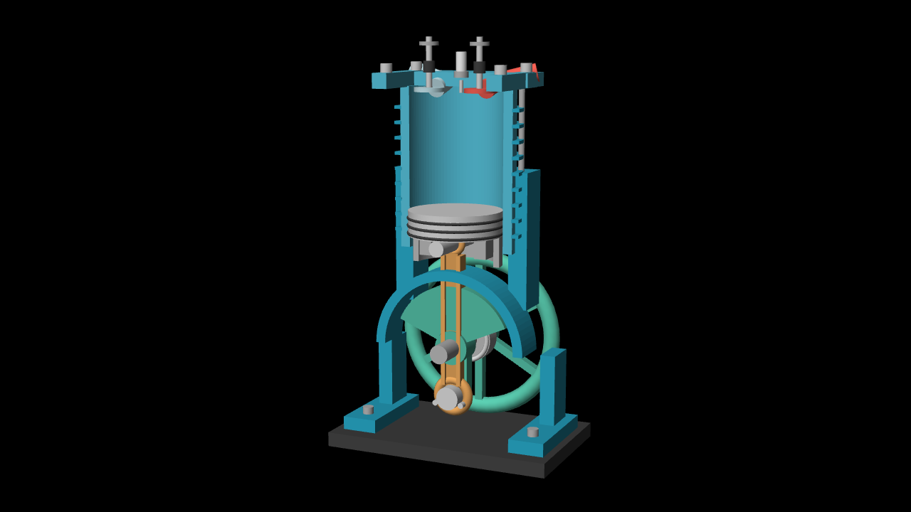
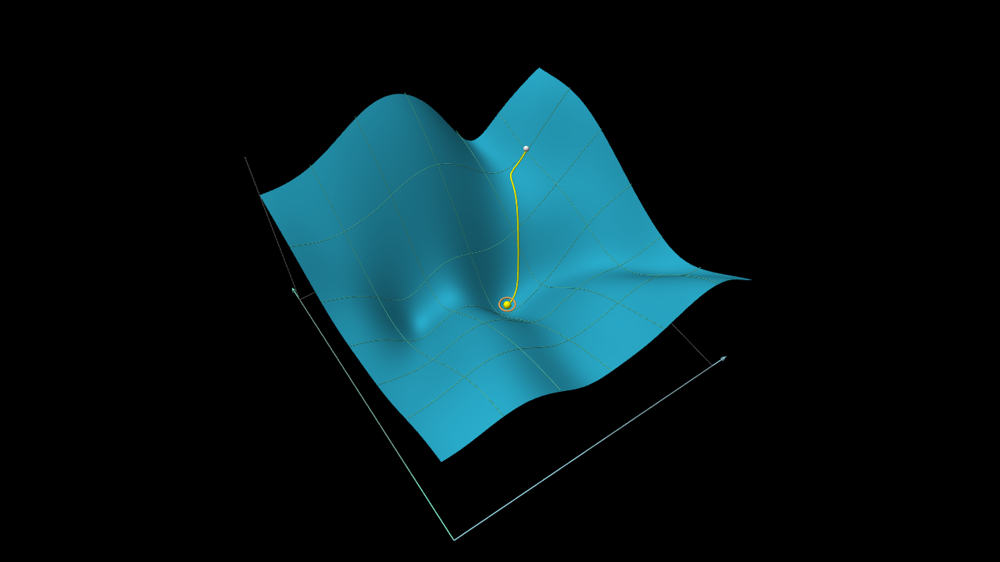
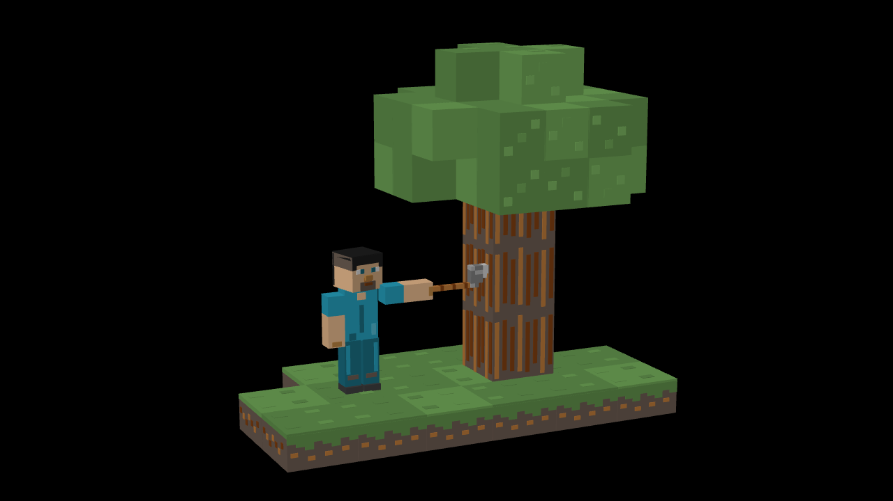

# Four standalone 3D visualization proofs

Open [the gallery](http://127.0.0.1:5207/proofs.html). Each proof has its own
silent, seekable timeline and geometry-driven orbit view. Drag a model to orbit,
Shift-drag to pan, and use Reset view to restore the authored camera.

| Proof | Construction | Duration |
| --- | --- | --- |
| DNA | Twelve deposited base pairs, 486 heavy atoms; clearer 75% radii or full volume; no bond lines; selectable central pairs | 14 s |
| Engine | Cutaway housing, constrained piston/rod/crank, flywheel and timed valves | 16 s |
| Gradient descent | Genuine 25-parameter neural-network MSE on a two-dimensional affine slice; 33 Armijo steps | 16 s |
| Minecraft | Articulated voxel Steve, detailed oak tree, three tool contacts, cracks and released inventory block | 16 s |

The scope is visual capability, not a narrated explanation or a training
simulator. Engine dimensions/timing are idealized. DNA omits unresolved hydrogen
atoms and deposited solvent. Gradient optimization is restricted to the shown
parameter slice. Minecraft uses original voxel geometry and an approximate
character palette. Detailed fidelity notes accompany each proof in the gallery
and in the adjacent `*-notes.md` files.

Latest DNA revision preserves all 486 deposited atom centers while using 75%
display radii and a groove-facing starting angle to reduce crowding. The Atom
size control restores full van der Waals volume. See [current DNA frame](dna-clear-frame.png),
[accuracy audit](dna-accuracy-audit.json) and [independent review](dna-readability-review.md).
Earlier images and validation reports document prior milestones.

The audit checks exact PDB atom records, 12 antiparallel complementary base pairs,
rendered mesh centers and radii, element colors, and rigid coordinates at seven
sample times in all four current control combinations. Run from repository root:
`bun shared/animlib/demo/proofs/validate-dna.mjs`. Fresh official RCSB ATOM records
also matched the vendored input on 2026-10-10. The 1.90 Å crystal structure is
experimentally resolved geometry, not an exact dynamic molecule; hydrogens and
solvent remain omitted. Smaller glyphs are explicitly a display convention.

## Texture update

The current gallery adds the newest upstream library texture/material capability
(`076f017`, PR #73). It modifies these same proof scenes in place. Original
untextured screenshots below remain the before reference; current frames are
under [`textures/`](textures/). See [texture verification](textures/README.md) and
the [independent review](texture-review.md).

These are agent-authored proofs using the integrated library and scene-authoring
guidance. They are not an untouched run of the production generation pipeline.
Engine, gradient and Minecraft were independently delegated; DNA and gallery
were integrated by the parent agent. Independent cross-reviews are saved here.
Repairs followed first frame inspection. No compiler deadlines or runtime
geometry limits were raised for these proofs.

## Verification

- Native production WebGPU frame inspection at 1280×720 and 960×720, including
  motion interiors, contacts and final holds. Representative PNGs are retained.
- Engine: 1,921 sampled transforms verify fixed rod length, connected pins and
  upright piston; maximum intermediate guide deviation is 0.000309 scene units.
- Gradient: analytic derivatives agree with finite differences to 1.51e-10;
  accepted MSE falls from 6.25185 to 0.359909. Trail clearance and surface-height
  interpolation were checked against the same objective.
- Minecraft: all three axe contacts hit the intended face; feet stay planted;
  cracks and block release follow contact.
- DNA: eight control combinations compile; four geometry variants pass winding
  checks. Space-filling endpoint framing was repaired and independently reviewed.
- Integrated browser: all four timelines reached their final hold. Model orbit
  was checked on each proof. DNA passed a cold browser-worker reload and its
  representation/region controls produced the requested views.
- `npm run typecheck --workspace animlib`, `npm run demo:build --workspace animlib`
  and `git diff --check` passed. The build retains the existing large-chunk warning.

Evidence is sampled, not a claim of exhaustive collision testing or framing at
every user-chosen orbit angle. DNA's Bun `-e` harness still exceeded the VM
deadline; fresh Bun file execution, Node and browser compilation passed. See
`dna-gradient-review.md` for the isolated limitation.

## Reproduce

From the repository root, run `npm run dev --workspace animlib -- --host 127.0.0.1 --port 5207`
and open `/proofs.html`. Authoritative modules live in
`shared/animlib/demo/proofs`. Production demo build includes the same gallery.

`node_modules/.bin/bun shared/animlib/demo/proofs/archive.ts` saves exact standalone
scene sources and SHA-256 provenance here. `provenance.json` also hashes the
vendored atomic input files. Numerical results and independent review reports
are retained beside those sources; full native image sequences remain under
the local ignored `data/spatial-proofs` directory.

