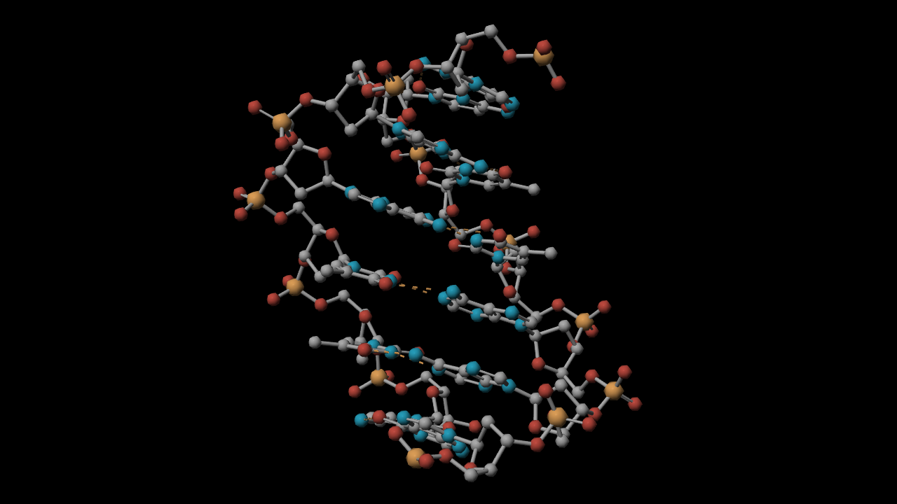
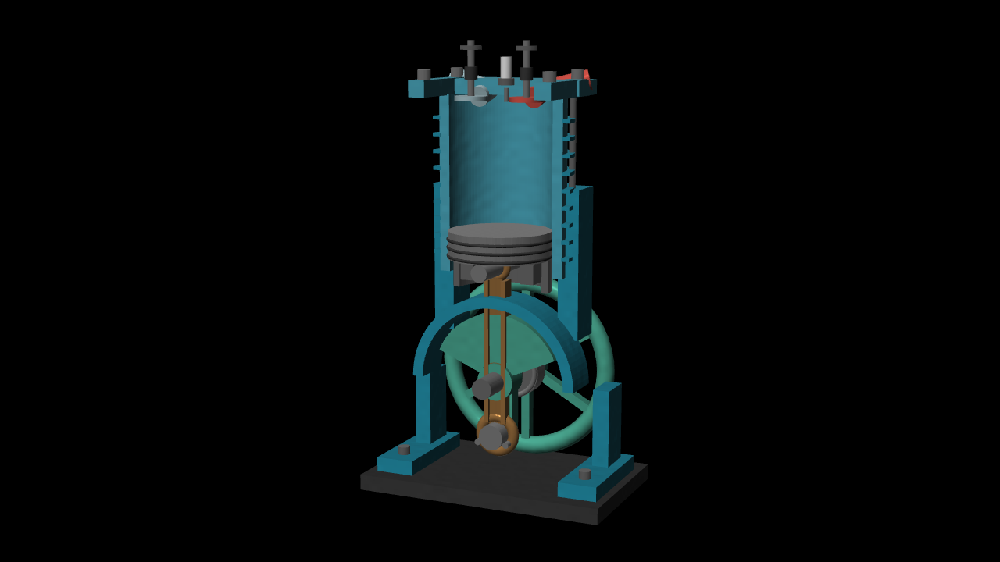
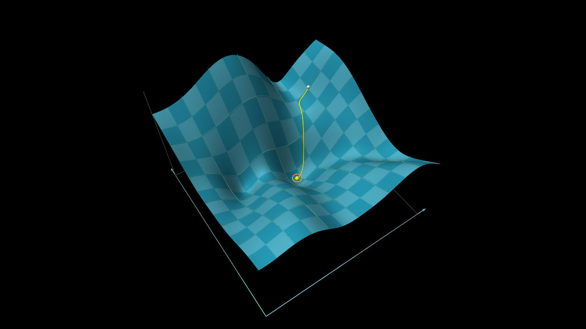
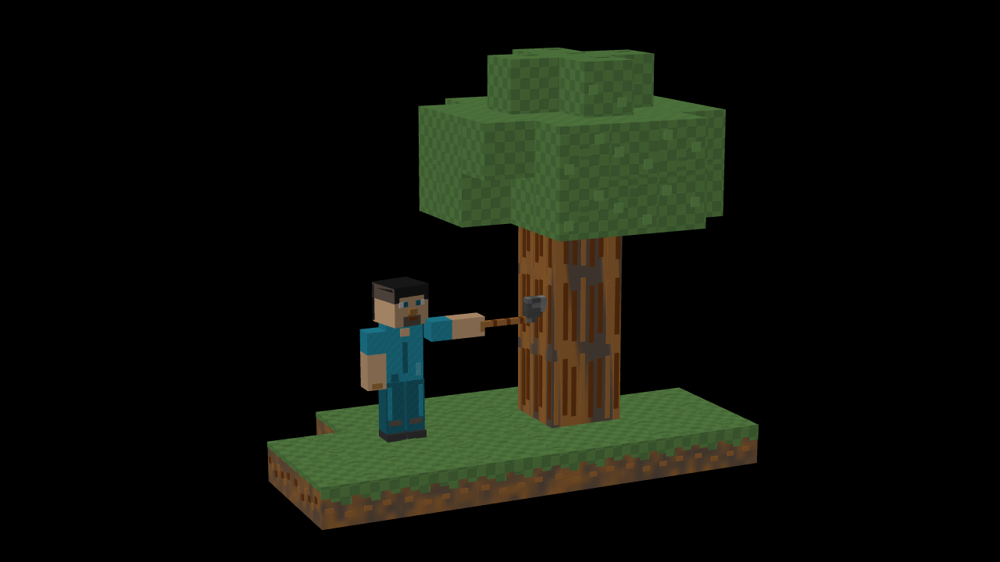

# Texture revision of the existing proofs

This revision integrates all `shared/animlib` changes from upstream commit
`076f017b4d7e73d1d13cc0e95783df6e090fa635` (PR #73). This is the newest library
commit on `origin/main` as fetched at `aaf8249` on 2026-10-10. The branch retains
its geometry-only orbit and native frame renderer. No unrelated upstream app
features were pulled in.

The four models were edited in place. DNA uses same-color satin relief while
preserving its element colors. The loss landscape uses equal parameter-plane
checker intervals and no bump displacement. Engine parts use cast and machined
metal finishes; Minecraft adds original procedural bark, soil, grass, leaf and
fabric patterns. These are shader textures, not downloaded game assets or
measured molecular surfaces.

Preservation checks compare before/after compiled/evaluated scenes after removing
only `texture` and `material`. DNA and gradient match at eight sampled times;
engine and Minecraft match complete compiled state and 321 sampled frames each.
Geometry counts, cameras, timeline, atomic coordinates, loss solver, joints and
contacts remain unchanged. Reports are retained here. Original source baseline
is commit `91c5501`; current exact sources and hashes are in the parent directory.

First native frame review found excessive bump on engine and voxel surfaces.
Only after that review, bump strength was reduced and frames rerendered. Both
16:9 and 4:3 final frame sets were inspected. The independent reviewer found no
remaining blocking reasoning, readability or style issue; its modality and
limitations are recorded in `../texture-review.md`.

Generation guidance now covers texture/material construction, local XYZ pattern
orientation and scale, palette continuity, conservative bump strength, retained
controls, morph limitations and supported APIs. The full texture reference is
included in the extracted scene-author context. The authoring, planning,
verification and repair Markdown files agree. There is no added model stage and
repair still follows first verification. This demo update is a bounded edit of
existing scenes, not a new unedited production generation benchmark.

Validation: 461 library unit tests, 198 backend tests and seven focused native
GPU texture/material/bump checks passed. Library/backend typechecks, demo build
and isolated app build passed. Existing large-bundle warnings remain. Browser
playback reached the final hold on all four proofs; engine orbit was checked
with materials active. DNA's space-filling central-pair selection was inspected
at the final zoom. These are sampled playback/control observations, not an
exhaustive temporal-aliasing guarantee. The local app on port 8085 was rebuilt
and its idle backend reloaded; `/healthz` returned `ok:true`.

