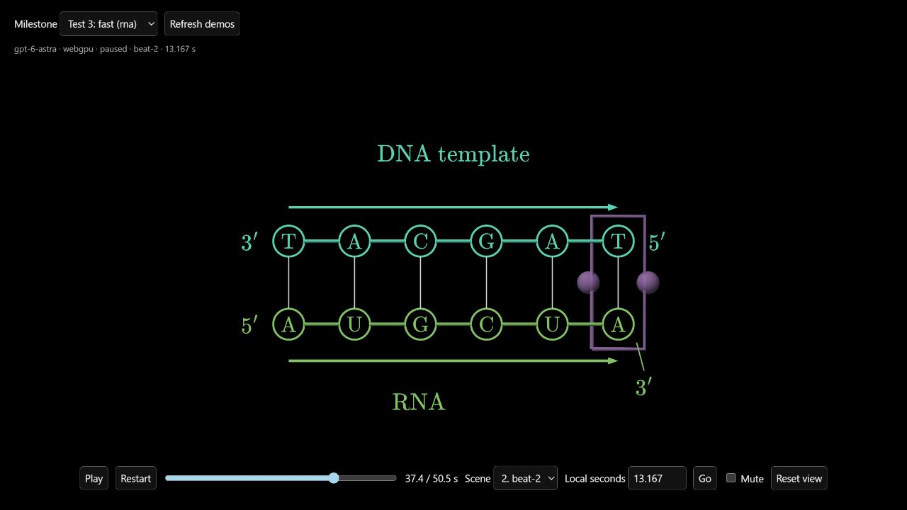

# Fast versus previous generation: three matched RNA tests

Question: does verification-first generation preserve output quality compared
with the previous, more expensive review-and-rewrite loop?

**Result: fast took 51.3% less time on average, with comparable science and
reference style. Blind visual review preferred fast twice and previous once.
Neither pipeline reliably eliminated overlaps.** This small sample supports
keeping the fast default; it does not prove lossless quality or statistical
superiority. The next quality target is clearance during motion and label
transitions, rather than restoring unconditional full-source rewrites.

| Repeat | Fast time | Previous time | Blind visual preference | Remaining issue |
|---|---:|---:|---|---|
| 1 | 5m34s | 15m10s | Fast, moderate confidence | Previous: polymerase rim crosses active base letters |
| 2 | 5m18s | 9m59s | Previous, moderate confidence | Fast: moving rim crosses base letters |
| 3 | 4m47s | 6m59s | Fast, small preference, moderate confidence | Previous: brief overlapping RNA label transition |
| Mean | **5m13s** | **10m43s** | Fast preferred 2/3 | Neither consistently clear |

All six completed automatic publication checks and browser playback. Independent
held-out review found no sampled readability revision in 2/3 fast and 1/3 previous
outputs. Every output preserved correct science, object identity and the existing
black-space, serif, restrained-color visual language. The third comparison's
defect is brief and local; do not treat the 2–1 preference as a large quality gap.

These times cover each two-scene lesson (50.533 seconds of playback), not one
scene. Median generation time was 5m18s fast versus 9m59s previous (47.0% lower).
Average model authoring time was 3m56s versus 4m05s; review plus repair was 1m12s
versus 6m28s. The speed gain was primarily reduced review/rewrite work. Total
provider calls were 30 versus 53; recorded output tokens were 39,099 versus
96,778, including provider-reported reasoning in the output token count. Token
counts are not a billing estimate.

## Demos

[Open all six demos](http://127.0.0.1:5207/quality.html?manifest=http%3A%2F%2F127.0.0.1%3A5209%2Fmanifest.json&run=rna-fast-slow-20261010-3-fast)
and use the **Milestone** selector to switch versions/repeats. Local servers must
remain running. The prompt-test website remains at http://127.0.0.1:8085/.

Exact delivered scene sources and machine-readable timing/source provenance are
saved beside [results.json](demos/quality-comparison/results.json). Full candidate,
gate and held-out frame evidence remains in the local experiment directory.

The user selected **three fresh repetitions of the fixed RNA prompt per version**.
The experiment therefore contains six newly generated two-scene lessons. No model
output is manually refined or selectively regenerated. Failed generations remain
part of the comparison.

## Controlled setup

- Fast: `1c79058d90af77f846df92d50dc608f3e3b99db8`, verification-only first,
  one targeted repair maximum, final independent verification.
- Previous: `1d47cbedd5d2bb6d8281874cbb8a1dfbcee3c2bc`, combined review/full-source
  rewrite, up to three rendered candidates.
- Same `gpt-6-astra`, high thinking, production authoring instructions, renderer,
  quality rules, style-reference image, audio, timing and two-scene lesson plan.
- Prompt SHA-256:
  `d9fc8548aa918d87a164f15d4d2ad73e833b14517343ddfd67df683f567e9310`.
- Each second scene inherits its version's own approved first-scene state.
- One pair runs at a time, both versions concurrently. Reported time includes
  generation and automatic publication checks; frozen planning/TTS are excluded.
  Shared provider load/cache and model randomness prevent exact causal timing
  attribution from this small sample.

Snapshots, input hashes, stage metrics, candidates, failures and native frames
are retained under `data/quality-comparison/rna-fast-slow-20261010/`.
The isolated harness is [quality-comparison.ts](../backend/bench/quality-comparison.ts).
Production defaults and the running user website are unchanged by this study.

## Independent quality method

Reviewers see anonymous A/B labels, actual frame sheets and source/timing context,
without the version identity or generation times. Sixteen fixed timestamps per
scene are rendered at 1280×720 and 960×720, separately from the automatic gate's
adaptive samples. Inspect full-resolution frames wherever sheets suggest a
problem. Review complete scene transitions and representative live playback.

Keep four judgments separate: scientific/explanatory reasoning, visual
readability, identity/continuity and reference style. A substantive failure is
not averaged away by attractive styling or a lower generation time. A failed
publication remains a delivery failure even if its unapproved candidate looks
plausible. Frame review cannot certify every unsampled instant or arbitrary
interaction pose.

## Visual evidence

Test 1's independent blind review preferred A with moderate confidence. After
the review was saved, the mapping revealed A = fast and B = previous. Both
preserved science, molecular identity and the established visual style. The
previous version left its moving purple outline crossing RNA C and template G
at scene 1, 3.762071429 seconds, in both aspect ratios. The primary reviewer
also inspected the full-resolution evidence and confirmed the overlap.

- [Blind review](demos/quality-comparison/test-1-blind-review.md)
- Same-time native frames: [fast](demos/quality-comparison/test-1-fast.png),
  [previous](demos/quality-comparison/test-1-slow.png).

Test 2's independent blind review preferred B with moderate confidence. The
saved review was then unblinded: B = previous and A = fast. Both preserved
science, identity and style. The fast version's moving rim intersects template C
and RNA U at scene 0, 17.284494048 seconds, in both aspect ratios. The primary
reviewer confirmed that defect in the individual native frame.

- [Blind review](demos/quality-comparison/test-2-blind-review.md)
- Same-time native frames: [fast](demos/quality-comparison/test-2-fast.png),
  [previous](demos/quality-comparison/test-2-slow.png).

Test 3's independent blind review had a small preference for B with moderate
confidence. Unblinding showed B = fast and A = previous. At scene 1, 0.5 seconds,
the previous version superimposes its outgoing `RNA: U ≠ T` and incoming `RNA`
labels. The primary reviewer confirmed the overlap in the individual frame.
Both versions retain correct science and visual style; the issue does not
obscure molecular pairing or establish a broad lesson-quality downgrade.

- [Blind review](demos/quality-comparison/test-3-blind-review.md)
- Same-time native frames: [fast](demos/quality-comparison/test-3-fast.png),
  [previous](demos/quality-comparison/test-3-slow.png).

The independent reviewer inspected 384 native candidate/aspect/time frames via
contact sheets, reopening suspected defects and selected comparisons at full
resolution. Review documents were saved before each version mapping was read.
The original approved outputs remain unchanged, including the observed defects.

## Delivery verification

- All 12 source hashes matched their automatic approval receipts. All six
  first-scene author prompts were byte-identical, SHA-256
  `0fbfb5a9b63d70487dab8fb2f836c70033e27d370a2b88422dbc19778ae00df3`.
- All six lessons ran continuously through both scenes to `ended`, 50.5/50.5
  seconds, with no browser console errors. [Playback evidence](demos/quality-comparison/playback.json).
  Playback was muted; this checks media progression and scene handoff, not a
  fresh listening assessment. Audio bytes and cue timing were frozen across arms.
- The isolated harness passed its strict TypeScript check. An independent code
  reviewer checked historical-module relocation and the audit corrections.
- Native frames cover both 1280×720 and 960×720. This is an interactive animlib
  delivery, not an encoded MP4; unsampled poses and perceptual frame-rate quality
  are not certified by these checks.

Three repetitions provide a useful comparison, not proof of statistical
equivalence or a universal lossless-speed guarantee. No production default was
changed during this comparison.

## Method notes

The first pair started before an audit-only timestamp-field bug was corrected.
Both model runs completed successfully and their generation times were retained.
The corrected audit rerendered their saved approved sources; no generation was
retried or manually changed. Subsequent pairs use the corrected harness and wait
for both generation timers to stop before any held-out audit rendering.

A native audit smoke check using an earlier saved demo overlapped first-pair
authoring. This small local CPU/GPU load, concurrent provider requests, cache
variation and stochastic authoring mean wall times are observational. Per-stage
model timings are also retained; extra review work does not itself prove better
final quality.
