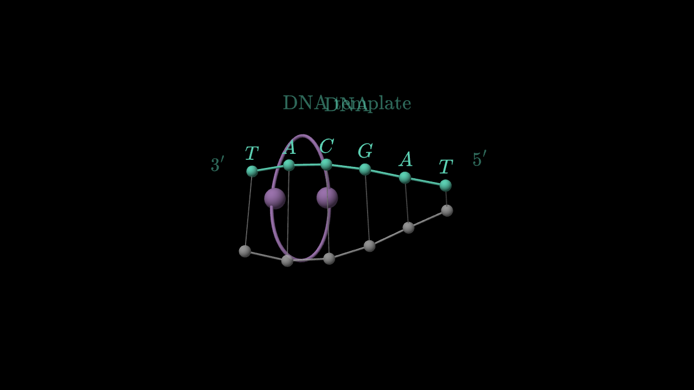
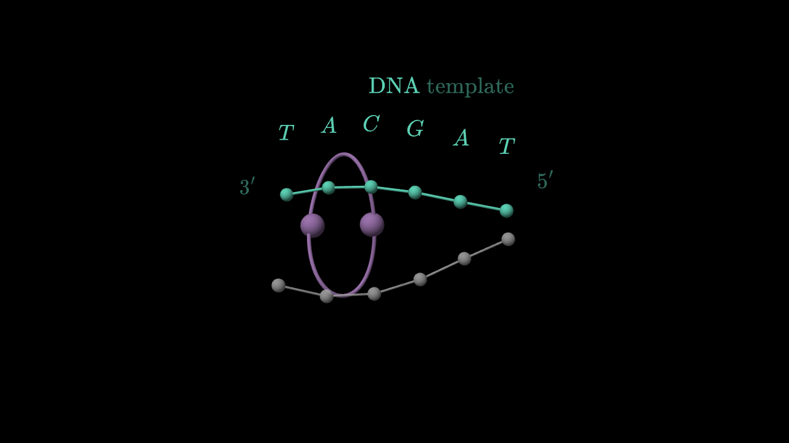
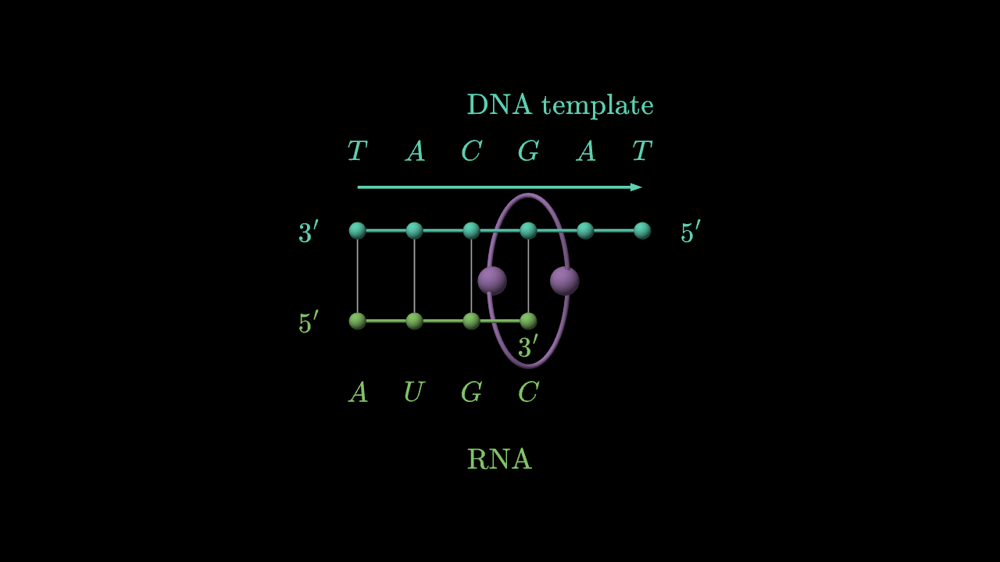
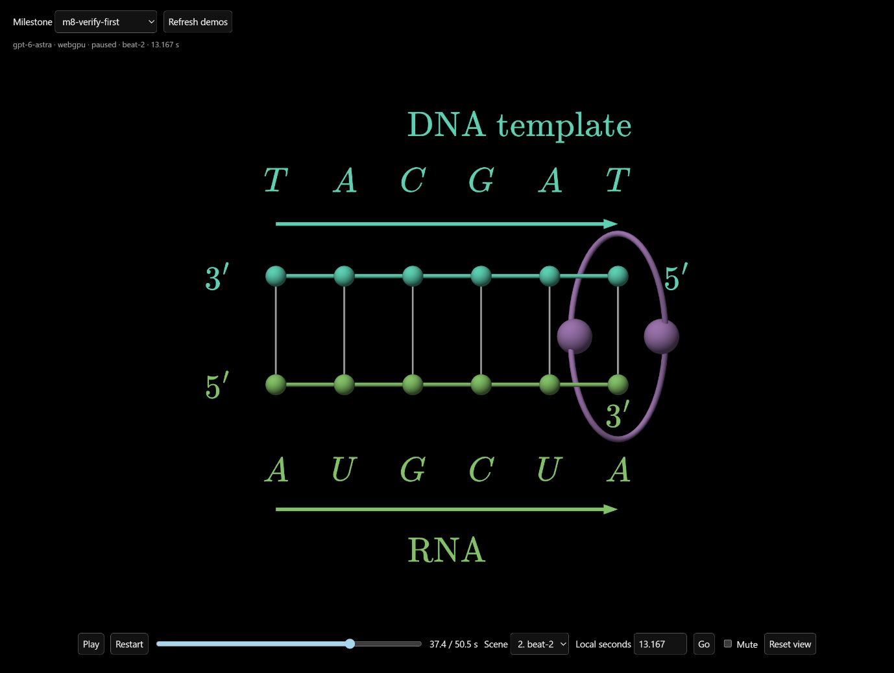

# Verification-first generation

Branch: `amilibsam`. Every newly authored production scene now follows:

1. Generate source and run the existing technical validators.
2. Render native frames, then ask for findings only. The response schema cannot
   contain replacement source or patches. Approval publishes the exact candidate.
3. On rejection, run one separate repair task. It returns exact, nonoverlapping
   edits tied to the original source hash and each verified finding. Every
   unaffected byte survives, including JavaScript/LaTeX escapes. Aggregate added
   or removed text cannot exceed 25% of original source length; unchanged context
   does not count. This blocks full rewrites disguised as patches.
4. Validate the patch, render again, and verify independently. Final rejection
   stops publication; no second visual repair pass or unverified fallback occurs.

Invalid code or invalid patch submissions may retry inside their authoring task.
These technical retries are distinct from an additional visual repair pass.

## Speed changes and preserved checks

Verification and repair use the existing terminal submission tool, avoiding an
extra model turn merely to acknowledge a validated result. Repeated successful
technical validation is cached only for identical source, quality mode and the
same immutable scene context. Returned frames are cloned; failures are not cached.
Duplicate quality-policy text is removed from prompts without dropping context.

The model (`gpt-6-astra`, high thinking), full source/request/narration context,
style reference, timestamp-selection algorithm, up to 12 timestamps at both
1280×720 and 960×720, and all technical/publication gates remain unchanged.
No weaker model, reduced image resolution, skipped final check or manual demo
source refinement is used.

## Same-original-source benchmark

Input: original scene 1 candidate from failed website job
`ef3508e6-40bc-4356-aac6-29aa25df5dc8`. Its unchanged SHA-256 is
`01709108ffc22d57156e22d4269e4dc10b9d13d182c11b68fab6e1ebec0ab72b`.
New result: `data/visual-speed/e83ec932-f0fe-4f71-8afb-2580e8b6502a/`.

| Model work | Previous combined review/rewrite | Verification-first |
| --- | ---: | ---: |
| First verification (old call also rewrote source) | 263.600 s | 29.205 s |
| Targeted repair | Included above | 36.424 s |
| Further verification/rewrite | 194.222 + 176.316 s | 8.070 s |
| Total model-stage elapsed time | 634.138 s | 73.699 s |
| Outcome | Rejected after three candidates | Approved after one targeted repair |

Model-stage elapsed time fell 88.4% in this observed run. New gate including
rendering/validation took 77.520 seconds. This excludes initial scene authoring,
lesson planning and narration. It is one before/after observation, not a latency
guarantee; model timing and output vary.

The patch moved obscured first-base/prime labels and added short leaders, without
rewriting unrelated TeX strings. Independent review inspected both native sizes,
confirmed complete antiparallel excerpts, readability and existing visual style.
Approved output SHA-256:
`90d9e9e2634fa973b772a9e0739f2d7f4265ec2ceac87d690470abf50802bd92`.

Reproduce from `backend/`:

```powershell
../node_modules/.bin/bun bench/visual-gate-speed.ts data/prompt-test/agents/ef3508e6-40bc-4356-aac6-29aa25df5dc8 1
```

## Fixed-prompt milestone

Run: `m8-verify-first`, video `97faaaeb-22d0-4bb2-9222-f3676827b3af`.
Same canonical RNA prompt, frozen plan and narration as M7; fresh source generated
through the production generator. No generated scene was manually edited.
Prompt SHA-256:
`d9fc8548aa918d87a164f15d4d2ad73e833b14517343ddfd67df683f567e9310`.

Scene 0's first verification identified an overlapping title morph, base labels
crossed by the polymerase rim, and pairing rungs stretching during opening. The
automatic patch anchored the unchanged DNA term, moved letters outside the rim,
and faded pairing rungs before strand separation. Final verification approved it.
Independent frame review confirmed these fixes at 6.5535, 17.583 and 24.1983 s,
with the existing black/serif/vector molecular style retained.

Scene 1's first verification caught its growing RNA `3′` label touching the
polymerase rim. Its entire patch changed one attachment offset from -0.5 to
-0.36. Final verification and independent native-frame review confirmed the gap
at 3.332 and 13.1673 s in both aspect ratios. The final state retains unchanged
`3′ TACGAT 5′` DNA and releases intact `5′ AUGCUA 3′` RNA.

The complete fresh run took **458.878 seconds (7m39s)** versus M7's 501.19 seconds
(8m21s). M8 needed two visual repair tasks; M7 needed one. Initial authoring still
accounts for about 300 seconds, including technical validation retries. The
isolated benchmark above measures the review bottleneck more directly.

All 96 native frames (four candidates × 24) were automatically reviewed. Both
final sources match their approval hashes, saved final frames match library
evaluation, and replaying both saved patches through the latest patch validator
reproduces published source exactly. A final validation run passed both scenes.

[Watch M8](http://127.0.0.1:5207/quality.html?run=m8-verify-first-97faaaeb-22d0-4bb2-9222-f3676827b3af).
[Scene 0](demos/rna-verify-first/scene-0.js),
[scene 1](demos/rna-verify-first/scene-1.js) and
[provenance](demos/rna-verify-first/provenance.json) are saved for inspection.

| Native frame at 6.5535 s | Before automatic repair | After automatic repair |
| --- | --- | --- |
| Title and DNA opening |  |  |



Live WebGPU playback traversed both scenes continuously and reached `ended` at
50.532 seconds with no recorded browser errors. The player retained the frozen
audio and exposed its normal playback/scene controls. No subjective audio-quality
claim follows from this check. The saved live view shows the repaired endpoint
and complete sequence, with player controls clear of the construction.



## Verification

196 backend tests and backend typecheck pass. Regressions cover verification
before repair, exact-byte preservation, disguised rewrites, stale/ambiguous edits,
invalid repair rejection, cancellation, final rejection without publication,
approval-source hashes, and cache isolation. Independent code review found no
remaining concrete defect.

Frame review establishes sampled readability/style, not every unsampled instant
or arbitrary interaction pose. Existing Docker GPU verification limitation from
M7 remains; this change was exercised with the local native WebGPU renderer.
